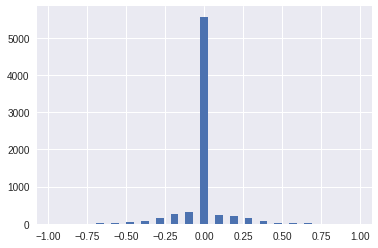
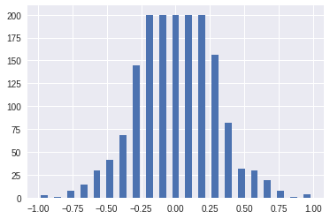
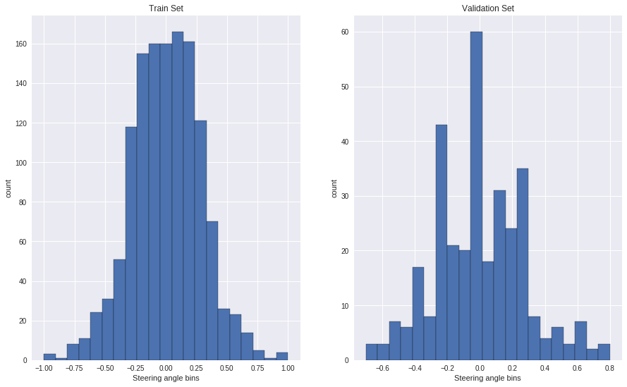
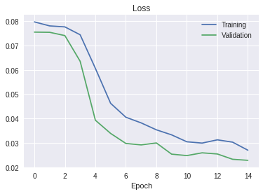

# Behavioral Cloning Project

[](http://www.udacity.com/drive)

Overview
---
This repository contains starting files for the Behavioral Cloning Project.

In this project, we will use deep neural networks and convolutional neural networks to clone driving behavior. The model we train using Keras will output a steering angle to an autonomous vehicle.


The Project
---
The goals / steps of this project are the following:
* Use the simulator to collect data of good driving behavior 
* Design, train and validate a model that predicts a steering angle from image data
* Use the model to drive the vehicle autonomously around the first track in the simulator. The vehicle should remain on the road for an entire loop around the track.
* Summarize the results with a written report

Administrative Stuff
---
Below are the files as required in the rubric
1. [drive.py](https://github.com/Surya11111/BehaviourCloning/blob/master/drive.py)
2. [model.py](https://github.com/Surya11111/BehaviourCloning/blob/master/model.py)
3. [model.h5](https://github.com/Surya11111/BehaviourCloning/blob/master/model.h5) <br>
Not viewable. Please download to run the simulator.
4. [video](https://github.com/Surya11111/BehaviourCloning/blob/master/run1.mp4) of the car driving itself. <br>
Not viewable. Please download to view.<br>
__PS: The video quality is not the greatest but I am submitting the project anyways. Will update if I create a better one after data augmentation.__
5. README <br>
This is the github readme.

## Steps

### Data Collection
The Udacity simulator was used in the following fashion
1. 3 laps recorded in the normal direction
2. 3 laps recorded in the flipped direction
3. 1 lap recorded as correction track: This recording has the car driving itself back to the road if it goes off the track

### Dataset summary
We have 2 types of files to look at in this dataset
1. __The driving_log.csv__ <br>
This file has information about the paths where the images (left, center, right) are stored on the disk, the steering angle, throttle, reverse, speed. <br>
For this project, we will only be focussing on steering angle and pose this problem as a regression problem. Our speed will be kept constant at 9kmh, however, at each frame, the steering angle will be predicted and the car will steer itself appropriately.
2. __IMG dir__ <br>
This directory consists images taken using the left, center and right cameras mounted on the car. For this version of the project, I used only the center images and could train a model to successfully steer it on road for 1 lap. <br>
For the next versions, when I work on the challenge problems, I might use the left and right images to make the model robust.

After the thresholding we have,

```python
X_train, X_valid, y_train, y_valid = train_test_split(paths, measurements, test_size=0.2, random_state=42)
# paths has the image path on the disk
# corresponding steering angle measurements of the images in the paths list
```

|  Total | Train  | Valid |
|----------|-----------|-----------|
|1642|1313|329|

### Dataset exploration and balancing using Thresholds

Let's check how our data was distributed before the thresholding and what is the final statistic of the dataset.

__Before Thresholding__ <br>
There are a lot of entries for steering angle 0



__After Thresholding__ <br>
We can now see that the distribution looks more normal and should be good to go ahead with the preprocessing step.



__Statistics of Train and Validation set__ <br>
After, splitting the data into train and validation set, here are the distributions for them respectively. The distribution looks identical and hence we are good to go ahead with the preprocessing and training procedure.



#### What is the thresholding step anyways?
Since we have a lot of images having 0 as the steering angle, we wanted to avoid any bias and there was no use training the algo on similar set of images with the prediction variable being same. So, we set __200__ to be a threashold and only that many images having steering angle 0 were picked __randomly__. 

```python
bin_threshold = 200
remove_ixs = []
for i in range(total_bins):
  temp_list = []
  for j in range(df.steering.size):
    if df['steering'][j] >= bins[i] and df['steering'][j] <= bins[i+1]:
      temp_list.append(j)
  # ensure that data is dropped randomly rather than a specific portion of the recording
  temp_list = shuffle(temp_list)
  temp_list = temp_list[bin_threshold:]
  remove_ixs.extend(temp_list)
df.drop(df.index[remove_ixs], inplace=True)
```

### Preprocessing Data
The preprocessing steps we are going to follow are listed below <br>

#### Color space selection
We will be using the model proposed by NVidia that uses the left, center and right images for the bahavioural cloning project.
Convert to __YUV__ space
```python
img = cv2.cvtColor(cv2.imread(img_path), cv2.COLOR_BGR2YUV)
```

#### Region of Interest
We can see that the scenery is actually a distraction for the model and we are better off focusing only on the road track. So, we will be slicing the part that is required and ommiting the upper half of the image.
```python
img = img[60:135,:,:]
```

#### Smoothing the image with a gaussian filter
This is usually a common step in the image preprocessing where our intent is to denoise the image of any form of clutter. As we are replicating the Nvidia model, we will use this step as mentioned in the model preprocessing stage.
```python
img = cv2.GaussianBlur(img, (3, 3), 0)
```

#### Reshape to fit the input size of Nvidia Model (200x66x3)
To avoid any form of bias as well as having to manage images differently depending only on its size is usually avoided by reshaping the input images to the same size. We can call it a standardizing step that helps us avoid unwanted computation. 
```python
img = cv2.resize(img, (200, 66))
```

#### Image Normalization
Normalization or min-max scaling is a technique by which the values in the image are scaled to a fixed range. In our case we will fit them between 0-1. Typically in a neural network architecture, convergence is faster if the data points follow a similar distribution. The variance in the data is also reduced by using normalization after the zero-centering. This makes the computations faster as well, thus helping in faster convergence.
```python
img = img/255
```

### Model Architecture and Training

Below is the architecture of the Model, a modified version as inspired from Nvidia Model.

|  Layer  | Output_Shape | Total_Parameters |
|----------|-----------|-----------
|conv2D|31x98x24|5x5x24x3+24=1824|
|conv2D|14x47x36|5x5x36x24+36=21636|
|conv2D|5x22x48|5x5x48x36+48=43248|
|conv2D|3x20x64|3x3x64x48+64=27712|
|conv2D|1x18x64|3x3x64x64+64=36928|
|dropout|1x18x64|0|
|flatten|1152|0|
|dense|100|1152x100+100=115300|
|dropout|100|0|
|dense|50|100x50+50=5050|
|dense|10|total_params=50x10+10=510|
|dense|1|total_params=10x1+1=11|


The configurations used are:

| Function | Type  | Comments |
|----------|-----------|----------|
| RELU | Activation | Used at the conv layers |
| MSE | Error function | Since this is a regression problem, we use mean squared error to predict the steering angle |
| ADAM | Optimizer | We use the adam optimizer with a learning rate of 0.001 |

Let's find out in short what each of the layers do: <br>
**Conv layer** <br>
We (rather the library) use a kernel or a filter that is a matrix of values and we do simple matrix multiplication and get values that are passed on as inputs to the next layers. This operation finds out certain details about the image like edges, vertices, circles, faces, etc. These kernels are chosen at random by the library and each of these produce some form of results about the features. These kernels are

**Fully connected layer (Dense)** <br>
The convolutional layers learn some low level features and to make most of the non-linearities, we use the FC layers that perform combinations of these features and find the best of these to use. This process is again done by using back propogation which learns the best of combinations.

**Dropout** <br>
We randomly drop some information from the network. Though there is a experimental proof about this working well, we can in short say that this method reduces over fitting. It is a form of Regularization.

#### Training
Finally that our architecture is decided, we use the __Adam optimizer__ for training the model. We would not go into details of how the Adam optimizer works but in short we can say that, "**An optimizer in general minimizes the loss in the network.**"

The hyperparameters: 

|  Name  | Value |
|----------|-----------|
| EPOCHS | 15 |
| LEARNING RATE | 0.001 |
| BATCH SIZE | 64 |



I trained for a few more epochs and did not see a possible improvement in the model and hence used 15 as the number of epochs.

## Discussion
---

### Potential Shortcomings in the Project 
1. Failing on the challenge track <br>
When the same model is used to run the simulator on the challenge track, the model fails and falls off the track. 

2. Possible overfitting <br>
As mentioned above, the model might be prone to overfitting as it fails terribly on the challenge track. 

### Possible Improvements
1. Data Augmentation <br>
The current train and validation set count is ~1300 and ~300 respectively; a very low number as far as a deep learning model is concerned. We will require a lot of more data and the simplest way can be augmenting the data by using flipping, rotations. etc. This way, the volume of data is increased with some variations added to what the network has to learn to make sure it stays on track.
2. Recording more data <br>
It will be useful to record a few laps on the challenge track as well as that might help avoid the overfitting. The model will then generalize better to the challenge track as well and probably to other types of terrians.
3. Using the other features available (Throttle, Speed, etc) <br>
We have a single image pipeline where we use the image characteristics as our features. It is a possibility that we use the other features available in the driving_log.csv which can aide our model.
